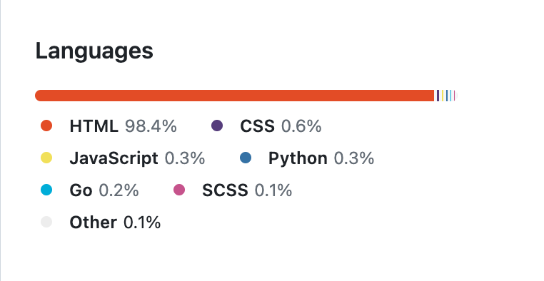
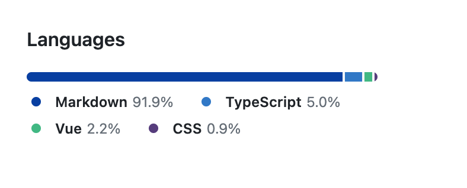

---
tags:
  - 网站/GitHub
  - 开发/Git
  - 命令行/git
  - 个人知识管理/知识库
  - 知识领域/文档工程
---
# 让 GitHub 仓库的代码占比统计中包含 Markdown 文件

## 背景

对于 Nólëbase 这样的使用 Git 作为版本管理和协作的知识库和其他众多的文档站点（比如 Kubernetes 文档站 [kubernetes/website](https://github.com/kubernetes/website)），默认配置的情况下，GitHub 可能会把仓库内的代码占比展示为下面这样：



可以观察到对于充斥着一定程度的 HTML 模板的仓库而言，即便实际仓库内包含的主要是 Markdown 文件，GitHub 也依然会把大量的 HTML 统计为占比最多的文件。

这是因为 GitHub

但殊不知，GitHub 其实是支持对 Markdown 文件类型进行统计计数的，只需要一点点额外的配置就能达到这样的效果：



上图是 Nólëbase 的主要仓库 [nolebase/nolebase](https://github.com/nolebase/nolebase) 的代码占比统计信息，可以看到在调整配置之后，Nólëbase 中的巨量 Markdown 文件就能被统计到占比中了。

## 如何实现

想要配置这样的功能其实很简单，在这一切背后，GitHub 使用了一个名为 [Linguist](https://github.com/github-linguist/linguist) 的组件来探测文件类型[^1]，这样的配置是通过在名为 [`.gitattributes`](https://git-scm.com/docs/gitattributes) 文件中实现的，你需要在根目录中创建一个名为

```
.gitattributes
```

的文件并且填充下面的内容

```
*.md linguist-vendored=false
*.md linguist-generated=false
*.md linguist-documentation=false
*.md linguist-detectable=true
```

就能实现对仓库内所有 `.md` 为拓展名结尾（Markdown）文件的配置。

这些配置选项具有这样的含义：

- `linguist-vendored=false` 表示匹配到的文件不是外部代码，如果配置为 `true`，则将会被在占比统计中排除
- `linguist-generated=false` 表示匹配到的文件不是生成的代码，如果配置为 `true`，则不仅会被在占比统计中排除，也会在 diff 中被排除
- `linguist-documentation=false` 表示匹配到的文件不是文档类型的文件，如果配置为 `true`，则将会被在占比统计中排除
- `linguist-detectable=true` 表示强制匹配到的文件纳入到占比统计中，即便文件是 `prose`（也就是 Linguist 认为的 Markdown 类型的文件）和 `data`（也就是 Linguist 认为的 SQL 这样的类型的文件）[^2]

详细的配置选项介绍可以在 [Overrides - Linguist supports a number of different custom override strategies for language definitions and file paths. · github-linguist/linguist](https://github.com/github-linguist/linguist/blob/master/docs/overrides.md#summary) 查阅到。

当然你也可以使用和 [`.gitignore`](https://git-scm.com/docs/gitignore) 一样的 [`glob`](https://en.wikipedia.org/wiki/Glob_(programming)) 语法来匹配目录：

```
docs/*.md linguist-vendored=false
docs/*.md linguist-generated=false
docs/*.md linguist-documentation=false
docs/*.md linguist-detectable=true
```

接下来你可以通过

```shell
git check-attr -a <文件路径>
```

这样的命令来测试文件所匹配得到的 attribute，就像这样：

```shell
❯ git check-attr -a README.md
README.md: linguist-vendored: false
README.md: linguist-generated: false
README.md: linguist-documentation: false
README.md: linguist-detectable: true
```

## 参考资料

- [Markdown language is not detected · Issue #3964 · github-linguist/linguist](https://github.com/github-linguist/linguist/issues/3964)
- [Add markdown as language · Issue #5951 · github-linguist/linguist](https://github.com/github-linguist/linguist/issues/5951)
- [Overrides - Linguist supports a number of different custom override strategies for language definitions and file paths. · github-linguist/linguist](https://github.com/github-linguist/linguist/blob/master/docs/overrides.md)

## 延伸阅读

- [How to Get Github to Recognize a Pure Markdown Repo](https://joshuatz.com/posts/2019/how-to-get-github-to-recognize-a-pure-markdown-repo/)
- 详细的 Linguist 配置选项：[Overrides - Linguist supports a number of different custom override strategies for language definitions and file paths. · github-linguist/linguist](https://github.com/github-linguist/linguist/blob/master/docs/overrides.md)
- 关于什么是 `.gitattributes` 文件：[Git - gitattributes Documentation](https://git-scm.com/docs/gitattributes)

[^1]: 在 GitHub 的讨论 [Add markdown code portion counting](https://github.com/orgs/community/discussions/30976) 中，作者 @airtower-luna 介绍了 GitHub 所使用的 Linguist 的文件类型探测模块的配置文档。
[^2]: 在 Linguist 的 [Issue #3964](https://github.com/github-linguist/linguist/issues/3964) 的[评论](https://github.com/github-linguist/linguist/issues/3964#issuecomment-354648277)中提到的：「data (e.g. SQL) or prose (e.g. Markdown)」